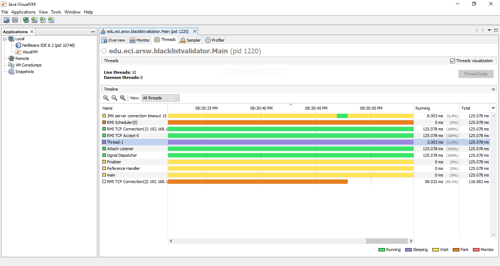
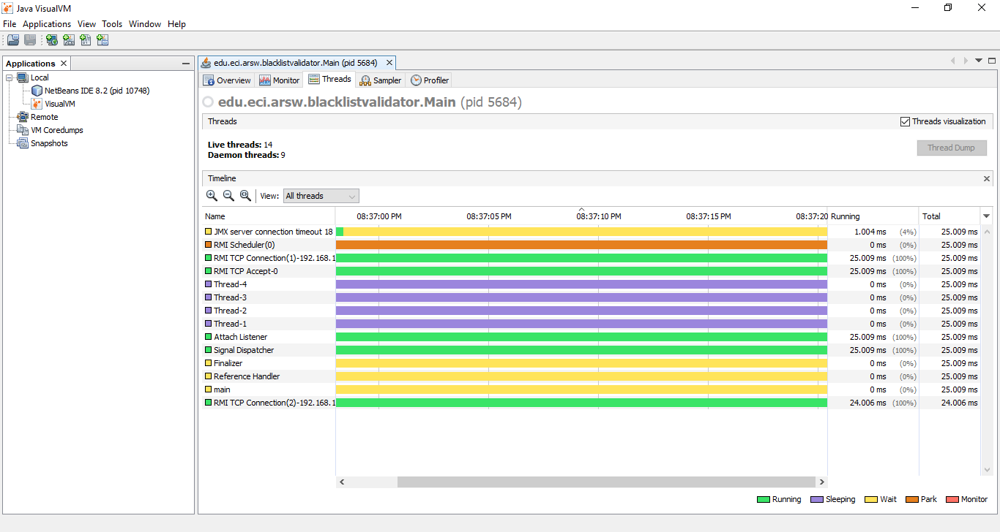
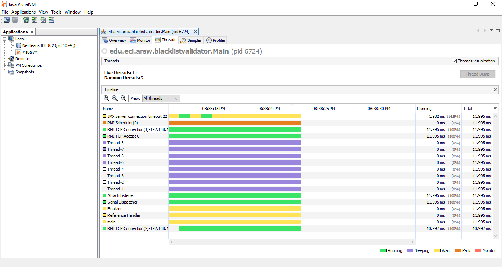
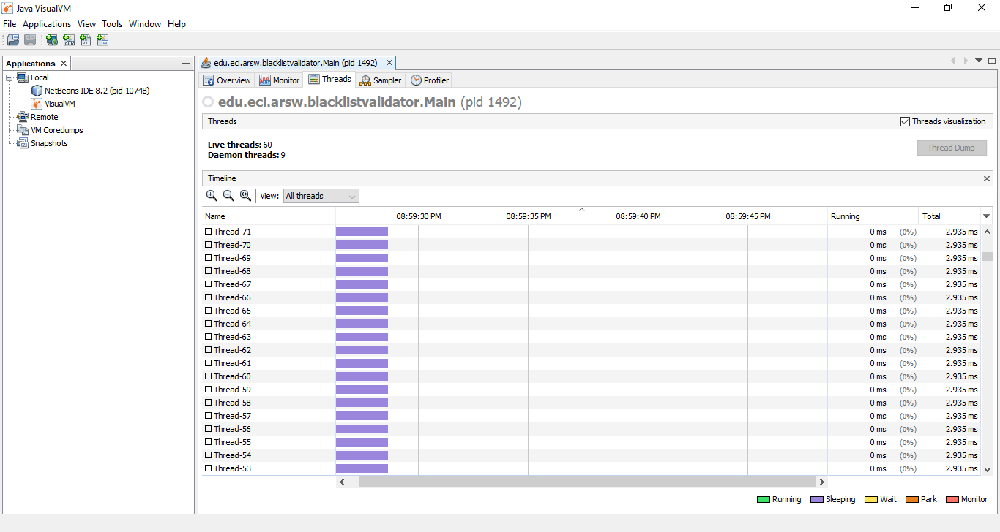
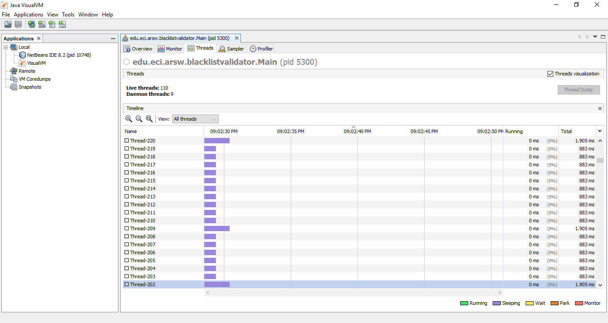
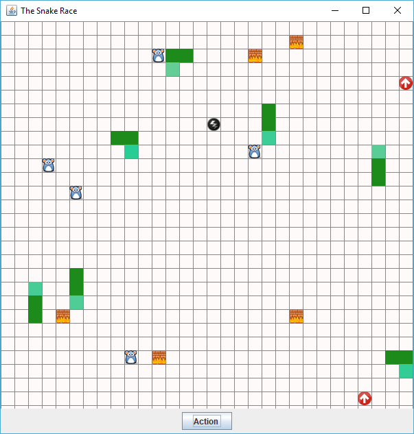

# workshop3

# Black List Search
## Part I - Introduction to threads in JAVA

[File of Start()](INTRODUCTION_BLACKLISTSEARCH/outputStart.txt)  
[File of Run()](INTRODUCTION_BLACKLISTSEARCH/outputRun.txt)

## Part II - Black List Search Exercise

[File of 60 threads](INTRODUCTION_BLACKLISTSEARCH%5Coutput60thread.txt)

## Part III - Discussion
> How could the implementation be modified to minimize the number of queries in these cases?  
> **Answer**: define a share variable that contains the number of occurrences, and do a conditional to verify when is the minimum value to stop all threads.

> What new element would this bring to the problem?  
> **Answer**: the conflict is that we have to ensure the integrity of the value in the variable. This is to guarantee that the value never is incorrect.

## Part IV - Performance Evaluation

### Questions

#### Amdahl's law 

> Why is the best performance not achieved with the 500 threads?  
> **Answer**: Is because the number of threads are more than available numbers of cores in the machine and the change of thread in the possessor take time, in a bigger volume of thread it take a significant time.

> How is this performance compared when using 200 ?
> **Answer**: 200 have a better performance because the number of threads is more near to the ideal number of thread that have a best performance.

> How does the solution behave using as many processing threads as cores compared to the result of using twice as much?  
> **Answer**: the threads as twice the number of processing cores is better than as many processing threads as cores because the exchange time of threads have it matters more with more threads.

> Amdahl's law would apply better ?  
> **Answer**: Amdahl's law says that the more processes, the better performance your program has. 

> would it be improved?  
> **Answer**: it improved in a relative way.

# Snake Race

## Part 1

Control threads using wait/notify.  
Result: [Output File](PrimeFinder/output.txt)

## Part 2
Image of the game.  

## Part 3

2. [Answer File](SNAKE_RACE/ANSWER.txt)  
3. Critical regions: The methods of each snakes that answer when a snake is about to hit another object. **Solucion**: synchronize the methods.
